## mermaid charts

### Flowchart

##### Example #1
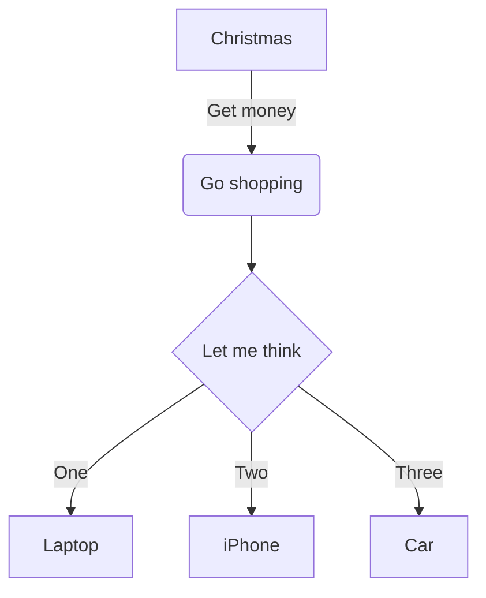

##### Example #2
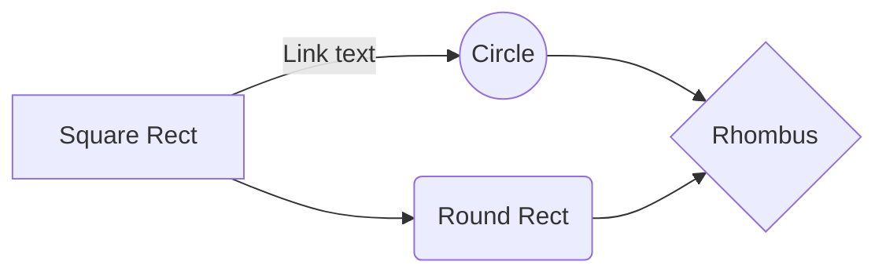

##### Example #3
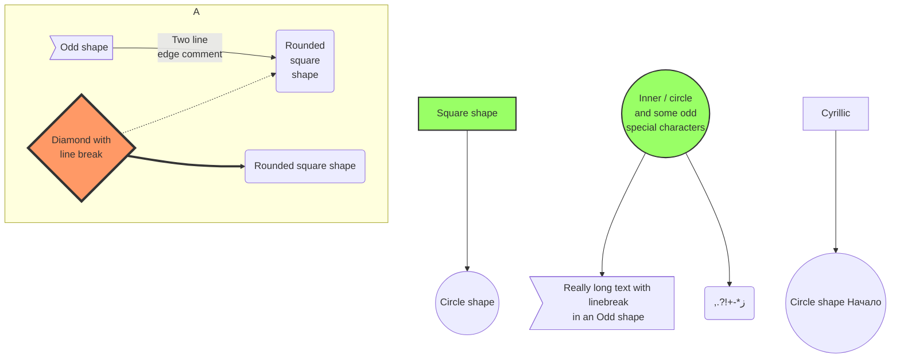

##### Example #4

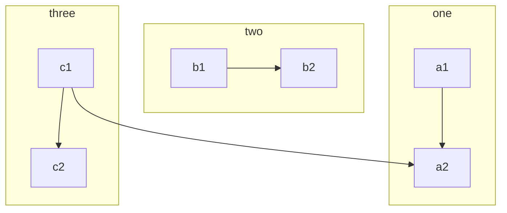
[Flowchart Syntax](http://knsv.github.io/mermaid/#flowcharts-basic-syntax)

::: warning
Adding many flowcharts will slow down the editor.
:::

### Sequence diagram

##### Example #1

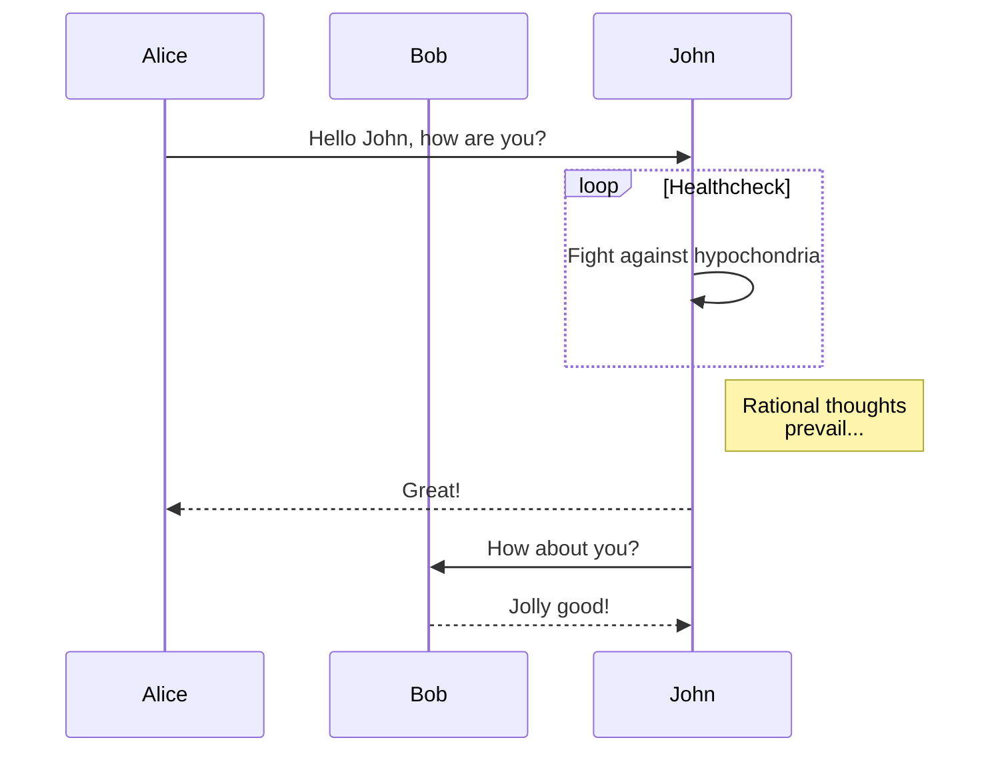

##### Example #2

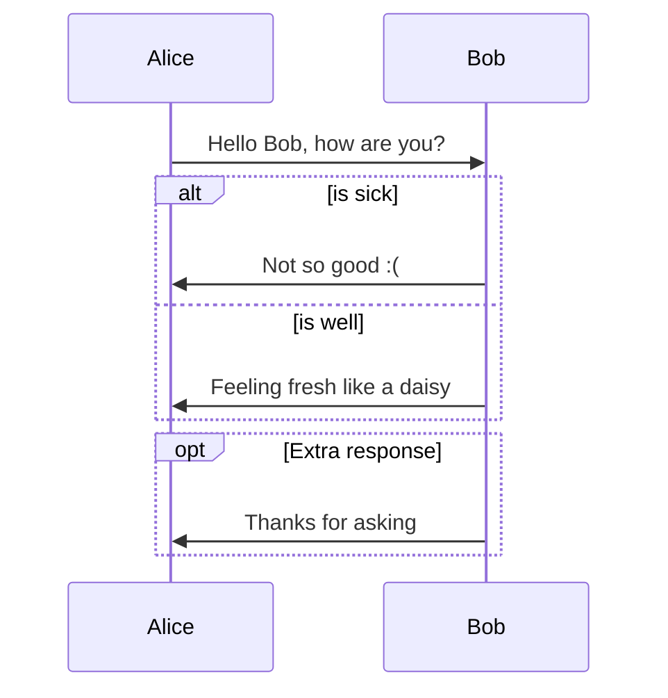

##### Example #3

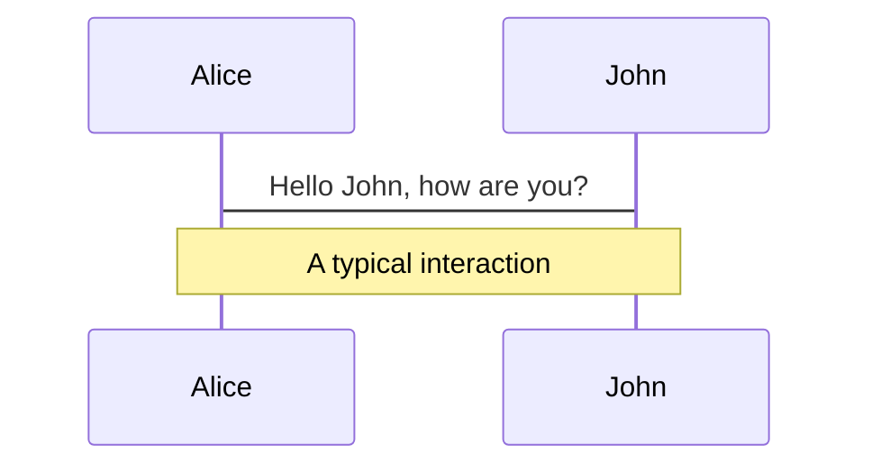

##### Example #4

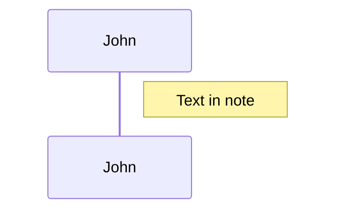

[Sequence Diagram Syntax](http://knsv.github.io/mermaid/#sequence-diagrams)

::: warning
Adding many sequence diagrams will slow down the editor.
:::

### Gantt diagram

##### Example #1

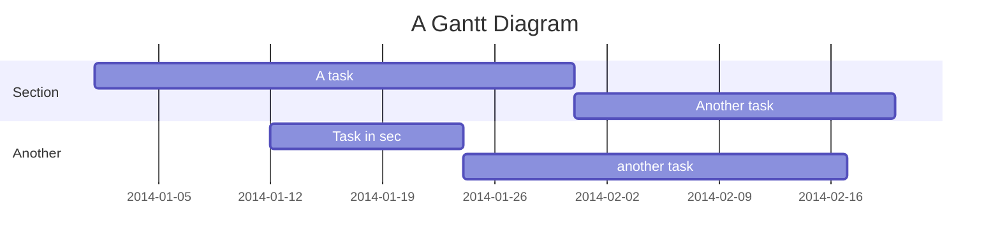

##### Example #2

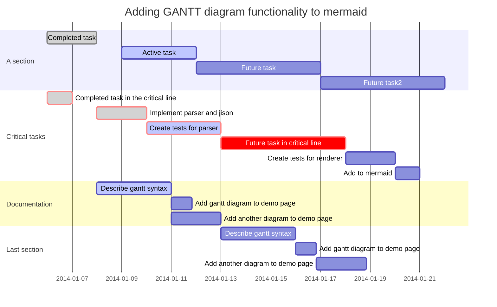

##### Example #3

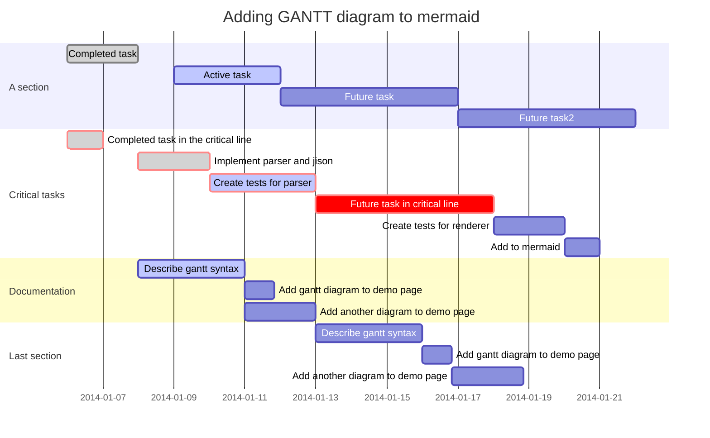

[Gantt Diagram Syntax](http://knsv.github.io/mermaid/#gant-diagrams)

::: warning
Adding many gantt diagrams will slow down the editor.
:::

### Class diagram

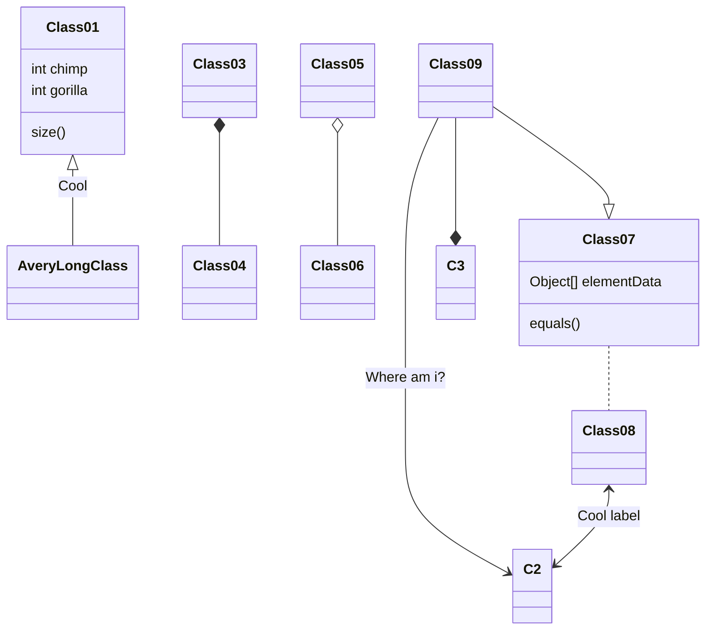

Class diagram is powered by [mermaid](https://github.com/knsv/mermaid).

::: warning
Adding many class diagrams will slow down the editor.
:::

### GitGraph diagram

